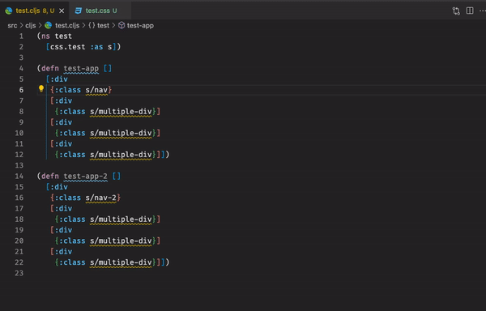

# Vscode extension

## custom `Jump to definition feature`

The project I am working on at my work is using css-modules. However, it doesn't work well with [css modules extension](https://github.com/clinyong/vscode-css-modules), because the project is using clojure. So I had to open CSS files whenever I had to fix something, which is somewhat irritating. So I made a Vscode extension to customize the `Jump to definition feature`.

## How it works

To customize language related features in vscode, check this [document](https://code.visualstudio.com/api/language-extensions/overview#programmatic-language-features). In this project, I used `vscode.languages.registerDefinitionProvider` API.

1. First, the extension is activated when it is a Clojure project.

2. When someone tries to `jump to definition` by hovering the mouse on some keywords, it provides the location of the definition based on the action I defined in `CSSModuleDefinitionProvider`.

3. When there are multiple definitions of the selected keyword, it shows definitions of the classname in the target CSS file.

## Preview

## Ref

- [vscode-css-modules](https://github.com/clinyong/vscode-css-modules)
- [calva](https://marketplace.visualstudio.com/items?itemName=betterthantomorrow.calva)

I got a lot of inspiration from those two extentions to make this extension.
